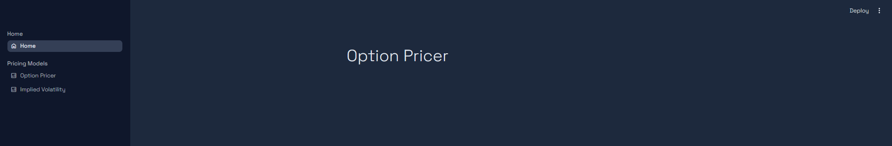
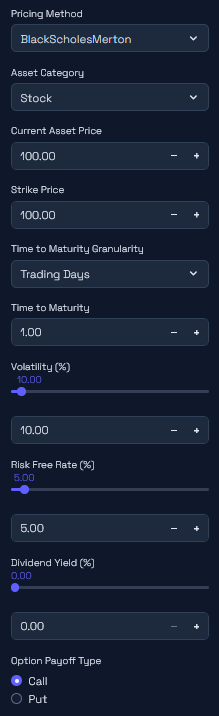
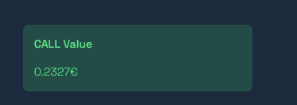
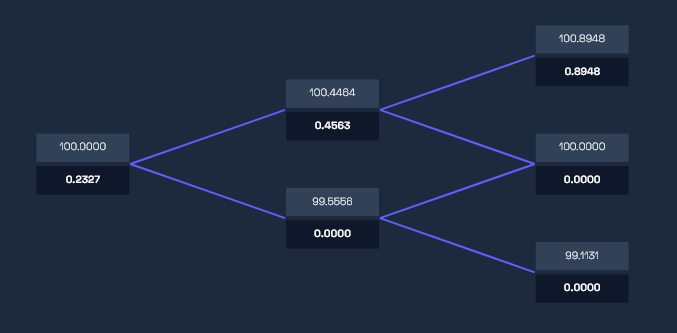
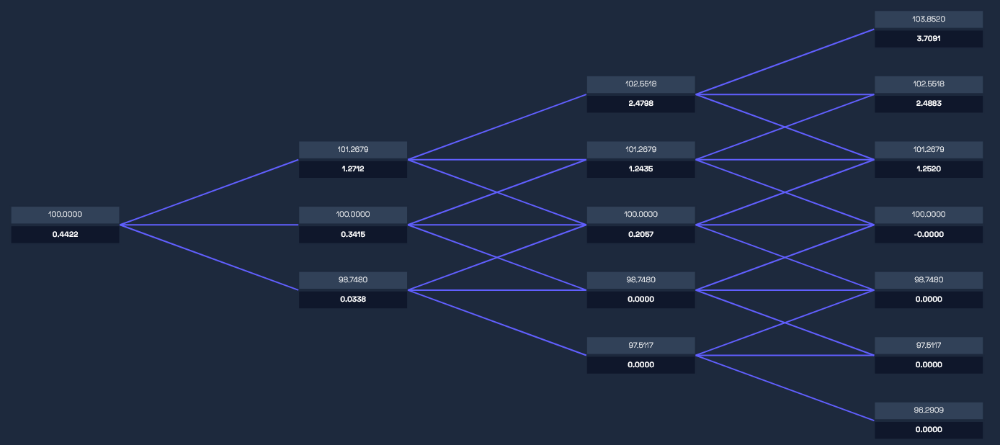
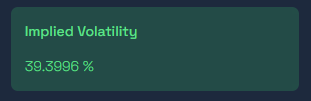

# OptionPricer
This repository implements several classical option pricing models for option pricing and showcases them using a Streamlit application. The methods implemented so far are the Binomial Trees model and the Black-Scholes-Merton model with greeks computations.

## Tutorial
This project requires an environment with a python version `python>=3.12`. The requirements are defined using the framework `poetry`.

1. In the project directory, execute the following command to install the requirements and activate the environment:

```
poetry install
```

```
poetry env activate
```

2. Once the environment is created and activated, start the project using the following command:

```
streamlit run ui\main.py
```

3. This brings up the home page.



## 1- Option Pricer

The `Option Pricer` page computes the prices of an option based on different parameters:



- `Pricing Method`: Defines which model to use.
- `Asset Category`: Type of the asset for which the option is to be calculated (Stock, Index, Currency, etc).
- `Current Asset Price`
- `Strike Price`: The exercise price for the option.
- `Time to Maturity`: Based on the granularity designated.
- `Volatility`
- `Risk Free Rate`: In percentage %.
- `Dividend Yield`: In percentage %, necessary for dividend-paying stocks/indices.
- `Foreign Risk Free Rate`: In percentage %, necessary for currency pricing.
- `Option Payoff Type`: Call or Put.

### Binomial Trees & Trinomial Trees

The `Binomial Tree` and `Trinomial Tree` models could be chosen in the `Pricing Method` selection box. They add two new parameters to adjust in addition to the ones mentioned before:

- `Number of Steps`: The steps of the tree model.
- `Option Exercise Style`: American or European.

The dashboard then displays the option price computed using the selected model.



The dashboard also plots the tree.

For the `Binomial Tree` Model:



For the `Trinomial Tree` Model:



### Black-Scholes Merton

The `Black-Scholes Merton` model could be chosen in the `Pricing Method` selection box. In this case, the dashboard computes the option price as well as the different greeks.


## 2- Implied Volatility

Using the `Black-Scholes Merton` model as well as the `Dichotomic Search` algorithm, the implied volatility is estimated.

The parameters taken are the same as for the option pricer, the only difference being the volatility that is switched with the option price.

The dashboard then gives the estimated implied volatility.


